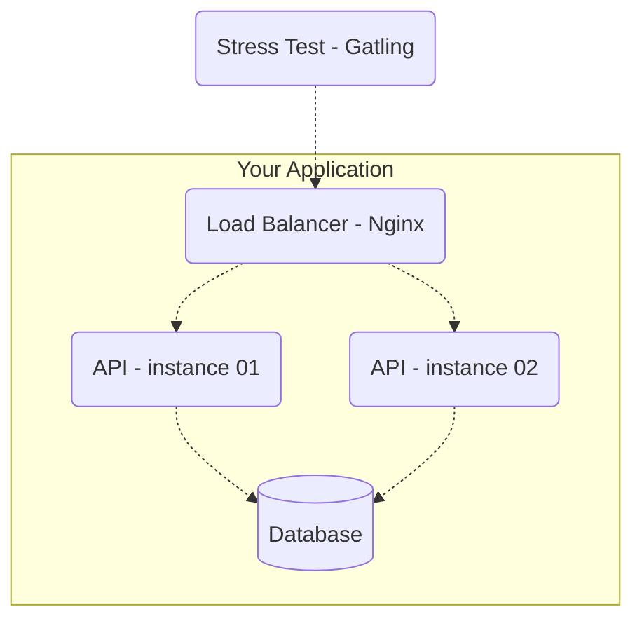

# Instructions and Rules for the Backend Tournament – 2023 Q3 Edition

## Summary

- The APIs must expose the same endpoints and necessarily use one of the following databases (your choice): Postgres, MySQL, or MongoDB.  
- The API deployment will be done via **docker-compose** with CPU and memory limits.  
- The test will be executed on a properly configured EC2 instance. The CPU and memory limits are meant to simulate constrained environments — be creative!  
- The [Gatling](https://gatling.io/) tool will be used to perform the stress tests.  
- The essence of this tournament is not competition (especially since there’s no prize for winning, haha), but knowledge sharing.  
- Details about the stress test [are here!](/stress-test/README.md)  
- You have until midnight on **August 22** (`2023-08-22T23:59:59-03:00`) to submit your PR. On August 25, there will be a live stream on [YouTube](https://www.youtube.com/zanfranceschi) to broadcast the Backend Tournament live.

---

## Endpoints

The APIs must expose **3 (actually 4)** endpoints:

- `POST /pessoas` – to create a person resource.  
- `GET /pessoas/[:id]` – to fetch a resource created by the previous request.  
- `GET /pessoas?t=[:search term]` – to search for people.  
- `GET /contagem-pessoas` – a special endpoint for counting the number of registered people.

---

### Creating People
`POST /pessoas`

It must accept a JSON request body with the following parameters:

| Attribute | Description |
| --- | --- |
| **apelido** | required, unique, string up to 32 characters. |
| **nome** | required, string up to 100 characters. |
| **nascimento** | required, string in date format YYYY-MM-DD (year, month, day). |
| **stack** | optional, array of strings, each string required and up to 32 characters. |

For valid requests, your API must return **status code 201 – Created**, along with a header  
`Location: /pessoas/[:id]`, where `[:id]` is the UUID (version of your choice) of the newly created person.  
The body content is up to you; return whatever you prefer.

**Valid request examples:**
```json
{
    "apelido": "josé",
    "nome": "José Roberto",
    "nascimento": "2000-10-01",
    "stack": ["C#", "Node", "Oracle"]
}
```

```json
{
    "apelido": "ana",
    "nome": "Ana Barbosa",
    "nascimento": "1985-09-23",
    "stack": null
}
```

For invalid requests, return **status code 422 – Unprocessable Entity/Content**.  
Again, the response body is up to you.

**Invalid request examples:**
```json
{
    "apelido": "josé", // “josé” already exists
    "nome": "José Roberto",
    "nascimento": "2000-10-01",
    "stack": ["C#", "Node", "Oracle"]
}
```

```json
{
    "apelido": "ana",
    "nome": null, // cannot be null
    "nascimento": "1985-09-23",
    "stack": null
}
```

```json
{
    "apelido": null, // cannot be null
    "nome": "Ana Barbosa",
    "nascimento": "1985-01-23",
    "stack": null
}
```

For syntactically invalid requests, respond with **400 – Bad Request**.  
Examples:

```json
{
    "apelido": "apelido",
    "nome": 1, // “nome” must be a string, not a number
    "nascimento": "1985-01-01",
    "stack": null
}
```

```json
{
    "apelido": "apelido",
    "nome": "nome",
    "nascimento": "1985-01-01",
    "stack": [1, "PHP"] // stack must be an array of strings only
}
```

---

### Person Details
`GET /pessoas/[:id]`

Must return the details of a previously created person.  
The parameter `[:id]` must be a UUID (any version).  
Response examples:

```json
{
    "id": "f7379ae8-8f9b-4cd5-8221-51efe19e721b",
    "apelido": "josé",
    "nome": "José Roberto",
    "nascimento": "2000-10-01",
    "stack": ["C#", "Node", "Oracle"]
}
```

```json
{
    "id": "5ce4668c-4710-4cfb-ae5f-38988d6d49cb",
    "apelido": "ana",
    "nome": "Ana Barbosa",
    "nascimento": "1985-09-23",
    "stack": null
}
```

Return **200 – OK** for existing records, and **404 – Not Found** otherwise.

---

### Searching People
`GET /pessoas?t=[:search term]`

Given a search term, the response must include a list of people where the term appears in any of the following attributes: `apelido`, `nome`, or any element of `stack`.  
Pagination is not required — you can return only the first 50 matching results.

Always return **200 – OK**, even when the result is empty.

Example: given the following people in your application:

```json
[{
    "id": "f7379ae8-8f9b-4cd5-8221-51efe19e721b",
    "apelido": "josé",
    "nome": "José Roberto",
    "nascimento": "2000-10-01",
    "stack": ["C#", "Node", "Oracle"]
},
{
    "id": "5ce4668c-4710-4cfb-ae5f-38988d6d49cb",
    "apelido": "ana",
    "nome": "Ana Barbosa",
    "nascimento": "1985-09-23",
    "stack": ["Node", "Postgres"]
}]
```

`GET /pessoas?t=node` should return:
```json
[{
    "id": "f7379ae8-8f9b-4cd5-8221-51efe19e721b",
    "apelido": "josé",
    "nome": "José Roberto",
    "nascimento": "2000-10-01",
    "stack": ["C#", "Node", "Oracle"]
},
{
    "id": "5ce4668c-4710-4cfb-ae5f-38988d6d49cb",
    "apelido": "ana",
    "nome": "Ana Barbosa",
    "nascimento": "1985-09-23",
    "stack": ["Node", "Postgres"]
}]
```

`GET /pessoas?t=berto` should return:
```json
[{
    "id": "f7379ae8-8f9b-4cd5-8221-51efe19e721b",
    "apelido": "josé",
    "nome": "José Roberto",
    "nascimento": "2000-10-01",
    "stack": ["C#", "Node", "Oracle"]
}]
```

`GET /pessoas?t=Python` should return:
```json
[]
```

If the query string `t` is missing, respond with **400 – Bad Request**.  
That means `t` is mandatory.

---

### People Count – Special Endpoint
`GET /contagem-pessoas`

This is a **special endpoint** that **will not be stress-tested**, so don’t worry about its performance.  
It must return (in plain text) the total number of people records, with any **2XX** status code.  
It will be used to verify the number of successful creations during stress tests — so don’t use cache or any eventually consistent mechanism.

---

### Important Note on Caching and Storage
You can use caching, but **all** records created through `POST /pessoas` must eventually be persisted in a non-volatile database (on disk).

---

## Component Restrictions

The test will use the following components and topology:



### Stress Test – Gatling
This component will perform the stress test against your application.

### Load Balancer – Nginx
The load balancer is included to simulate a production-like environment with multiple API instances for higher availability.

### API – Instances 01 and 02
The test will be executed using **two instances** of your API.  
Requests will be distributed using **round-robin** or **fair distribution**:
1st request → API 01  
2nd request → API 02  
3rd request → API 01 again, and so on.

### Database
You can choose between **Postgres**, **MySQL**, or **MongoDB** — up to you :)

---

## Application Setup Instructions

If you have trouble with anything, feel free to mention me on Twitter [@zanfranceschi](https://twitter.com/zanfranceschi).

---

### docker-compose File
Your application will be tested in containers via **docker-compose**, exposed on **port 9999**.  
Here’s an example of what your `docker-compose.yml` might look like:

```yml
version: '3.5'
services:
  api1:
    image: api
    hostname: api1
    depends_on:
      - db
    expose:
      - "80"
    deploy:
      resources:
        limits:
          cpus: '0.25'
          memory: '0.5GB'

  api2:
    image: api
    hostname: api2
    depends_on:
      - db
    expose:
      - "80"
    deploy:
      resources:
          limits:
            cpus: '0.25'
            memory: '0.5GB'

  nginx:
    image: nginx:latest
    volumes:
      - ./nginx.conf:/etc/nginx/nginx.conf:ro
    depends_on:
      - api1
      - api2
    ports:
      - "9999:9999"
    deploy:
      resources:
        limits:
          cpus: '0.25'
          memory: '0.5GB'

  db:
   image: postgres
   deploy:
      resources:
        limits:
          cpus: '0.75'
          memory: '1.5GB'
   # ...
   ...
```

**IMPORTANT:**  
You will have **1.5 CPUs** and **3.0 GB RAM** to distribute among your containers however you wish.  
The limits above are just examples — use them as you prefer.

---

### nginx.conf Example
Example configuration for distributing requests between the two API instances:

```nginx
events {
    # configure as you wish
}
http {
    upstream api {
        server api1:80;
        server api2:80;
    }
    server {
        listen 9999;
        location / {
            proxy_pass http://api;
        }
    }
}
```

---

### Docker Images
The `docker-compose.yml` file refers to images of your API, so these images must be **publicly available** on a registry such as [Docker Hub](https://hub.docker.com/).  
Otherwise, the organizers won’t be able to pull them.

---

### Submission Instructions
To participate:

- Create a **public Git repository** with your application’s source code.  
- Submit a **pull request** to this repository, creating a subdirectory under `/participantes/` (for example `/participantes/my-team/`) containing:
  - A `README.md` with a link to your source code repository.  
  - A `docker-compose.yml` with your API image declarations and correct resource allocations.  
  - Optionally, an `nginx.conf` with your load balancing setup (if using the default nginx image).  
    If not, your `docker-compose.yml` must reference a custom nginx image that includes these settings.
